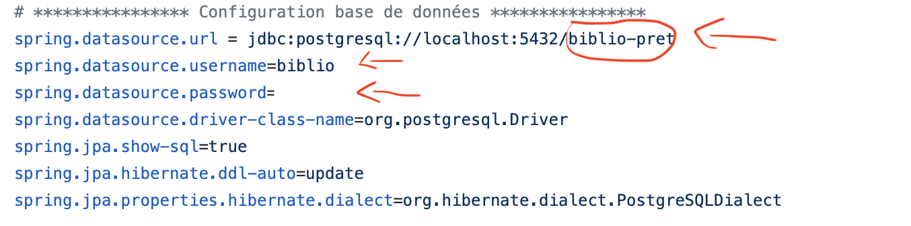
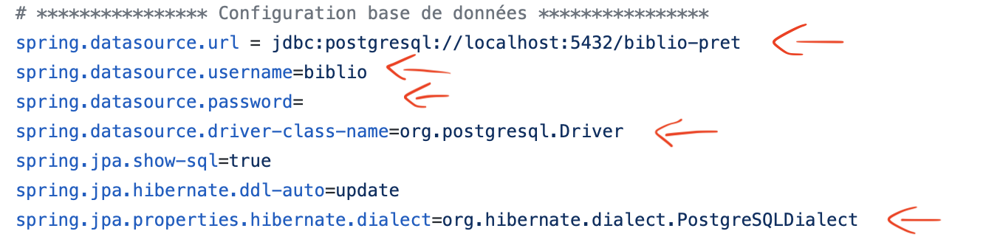

# Projet 7 - Développez le nouveau système d’information de la bibliothèque d’une grande ville

## Contenu

Ce projet est un système de gestion des bibliothèques d'une ville.

Il se compose de plusieurs microservices qui communiquent avec les clients (app-web et app-batch), par l'intermédiaire de "zuul", qui est une passerelle (gateway), pour leurs fournir les données dont elles ont besoins.

Il y a deux types de microservices :

1. #### Microservice métier :

    * Livre-service : gère les données des livres, des exemplaires et des bibliothèques.

    * Pret-service : gère les données des prêts.

    * Authentification-service : gère les données des utilisateurs et la connexion d'un utilisateur.

    * App-web : permet aux usagers de suivre les prêts de leur ouvrages à travers une interface web:

        * Rechercher des ouvrages et voir le nombre d'exemplaire disponible.
        * Consulter leurs prêts en cours.
        * Le prêt d'un ouvrage est prolongeable une seule fois. La prolongation ajoute une nouvelle période de prêt(4 semaines) à la période initiale.

    * App-batch : pour le traitement automatisé qui permettra d'envoyer des mails de relance aux usagers n'ayant pas rendu les livres en fin de période de prêt. L'envoie sera automatique à la fréquence d'un par jour.

2. #### Edge microservice : 

    * Config-server : permet à chaque microservice de récupérer sa configuration dans un dépôt distant.

    * Eureka-server : permet aux microservices de s'enregistrer pour qu'ils puissent communiquer entre eux.

    * Zuul-server : c'est la passerelle (gateway), chaque microservice qui souhaite communiquer avec un autre microservice devra passer par cette passerelle.

    * Spring-admin : permet d'avoir plusieurs informations sur les microservices enregistrés dans eureka.

    ###### *Si vous voulez tracer vos requêtes, il y a zipkin, pour cela il faudra au préalable exécuter le jar de zipkin, la procédure est détaillée dans la partie "installation et déploiement".

-------------------------------------

## Prérequis

* Java version 1.8

* Maven 3.6

-----

## Bases de données

Il y a 3 bases de données chaucune se trouvant dans les microservices :  
livre-service, pret-service et authentification-service.

Les scripts SQL présents dans src/main/resources/scripts dans chaque microservice permettent de créer une base de données avec un jeu de données.

* Création des tables : 
    
    * db_biblio-compte.sql
    * db_biblio-livre.sql
    * db_biblio-pret.sql

* Alimentation des données : 
    
    * jeu_de_donnees_compte.sql
    * jeu_de_donnees_livre.sql
    * jeu_de_donnees_pret.sql

La configuration des bases de données se trouve dans le microservice config-server, voici une image de ce dépôt :

Le SGBD (Système de Gestion de Base de Données) configuré dans ce projet est postgreSQL, si vous utilisez aussi postgreSQL, il faudra alors, pour pouvoir connecter l'application aux bases de données, changer :

1. le nom de la base de données, que vous souhaitez utiliser

2. le nom de l'utilisateur 

3. le mot de passe

dans le fichier "nom_du_microservice".properties (exemple : pret-service.properties) qui se trouve dans ce dépôt Github "https://github.com/Kamel94/cloud-conf" comme illustré dans l'image suivante.

si vous utilisez un autre SGBD, il faudra alors changer :

1. l'url de la base de données, que vous souhaitez utiliser

2. le nom de l'utilisateur

3. le mot de passe

4. le "spring.datasource.driver-class-name"

5. le "spring.jpa.properties.hibernate.dialect"

dans le fichier "nom_du_microservice".properties (exemple : pret-service.properties) qui se trouve dans ce dépôt Github "https://github.com/Kamel94/cloud-conf" comme illustré dans l'image suivante.

Une fois l'application démarrée, vous pourrez vous connecter via les utilisateurs enregistrés dans le jeu de données fourni, il faudra utiliser les identifiants et mots de passe suivant :

* identifiant = jeandupont@gmail.com
* mot de passe = jean
* statut = ADMIN

* identifiant = robertmercier@gmail.com
* mot de passe = robert
* statut = USAGER

* identifiant = patricklaporte@gmail.com *
* mot de passe = patrick
* statut = USAGER

##### *Pour tester le batch, vous pouvez changer l'adresse mail pour mettre la vôtre à la place dans le jeu de données fourni dans authentification-service.

---

## Installation et déploiement

### Si vous utilisez un IDE

* récuperez le projet Github en copiant ce lien : https://github.com/Kamel94/p7-biblio.git

* ouvrez votre IDE

* clonez le projet Github

* ensuite, il faudra démarrer les microservices en commençant par config-server puis eureka-server et finir par les clients (web et batch).
    
    #### Exemple d'ordre : 

    * config-server
    * eureka-server
    * spring-admin
    * zuul-server
    * livre-service
    * authentification-service
    * pret-service
    * app-batch
    * app-web

###### Si vous voulez tracer vos requêtes, il faudra au préalable exécuter le jar de zipkin en ouvrant un terminal, placez-vous dans le dossier p7-biblio et entrez cette commande : 
    
* ###### java -jar zipkin-server-2.21.1-exec.jar
###### Puis rendez-vous à cette adresse : http://localhost:9411/zipkin/

* enfin, ouvrez un navigateur web avec l'adresse :

    * http://localhost:8080/accueil

### Si vous n'utilisez pas d'IDE

* récuperez le projet Github en copiant ce lien : https://github.com/Kamel94/p7-biblio.git

* ouvrez le terminal ou la console, placez-vous dans le dossier où vous voulez déposer le projet

* clonez le projet Github en exécutant cette commande : 

    * git clone https://github.com/Kamel94/p7-biblio.git

* cela vous créera un dossier p7-biblio et vous pourrez voir dans ce dossier tout le projet avec tous les microservices

* ouvrez un terminal pour chaque microservice

* placez-vous dans le dossier p7-biblio/nom_du_microservice (exemple : p7-biblio/config-server)

* exécutez la ligne de commande pour chaque microservice* :

    * mvn clean package spring-boot:run

    #### *il faut exécuter cette commande en commençant par config-server puis eureka-server et finir par les clients (web et batch).
    #### Exemple d'ordre : 

    * config-server
    * eureka-server
    * spring-admin
    * zuul-server
    * livre-service
    * authentification-service
    * pret-service
    * app-batch
    * app-web

    ###### Si vous voulez tracer vos requêtes, il faudra au préalable exécuter le jar de zipkin en ouvrant un terminal, placez-vous dans le dossier p7-biblio et entrez cette commande : 
        
    * ###### java -jar zipkin-server-2.21.1-exec.jar
    ###### Puis rendez-vous à cette adresse : http://localhost:9411/zipkin/

* ouvrez un navigateur web avec l'adresse :

    * http://localhost:8080/accueil
